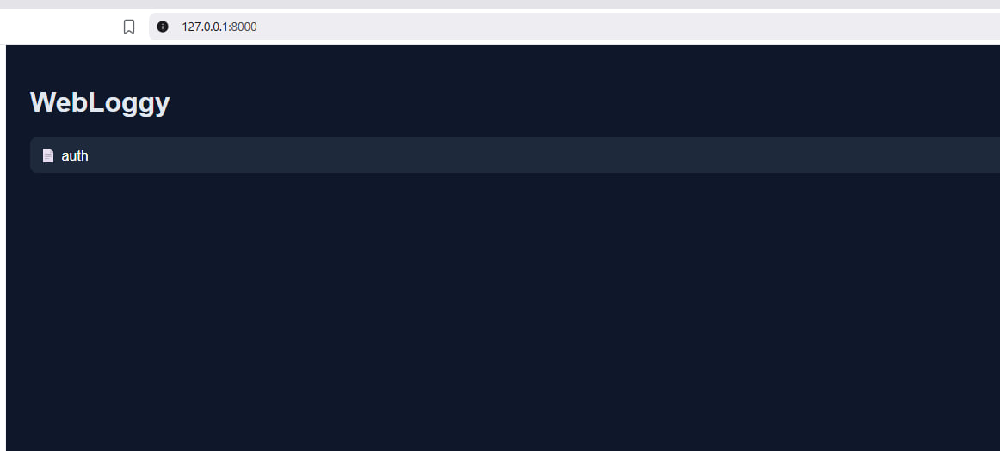
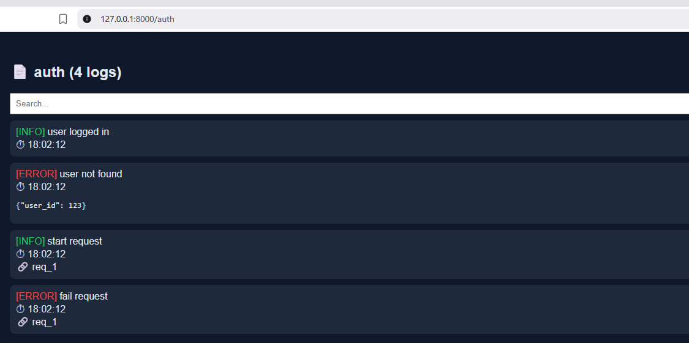

# WebLoggy 🚀

## 🌍 Язык

- 🇬🇧 [English](README.md)
- 🇷🇺 Русский

---

WebLoggy превращает ваши логи в удобный веб-интерфейс — мгновенно.  
Без настройки. Просто запускай и дебажь.

---

## 🖥 Превью

### Главная панель


### Просмотр логов


## ✨ Возможности

* 📄 Логирование по страницам — разделяйте логи по модулям
* 🌐 Встроенный веб-интерфейс — без сторонних инструментов
* 🧩 Структурированные логи — добавляйте контекст
* 🔗 Трейсы — группировка логов по запросам
* 🔍 Поиск — быстро находите нужные записи
* 💬 Telegram / Discord — опциональные уведомления

---

## 🤔 Зачем WebLoggy?

Отладка Python-приложений — это часто:
- разбросанные логи
- отсутствие структуры
- сложно отследить один запрос

WebLoggy решает это с помощью простого локального веб-интерфейса.

## 🚀 Быстрый старт

```bash
pip install webloggy
```

```python
from webloggy import Logger

logger = Logger()

auth = logger.page("auth")

auth.info("user logged in")
auth.error("user not found", user_id=123)
```

Запусти приложение и открой:
http://localhost:8000

---

## 🔗 Трейсы

```python
with logger.trace("req_1"):
    auth.info("start")
    auth.error("fail")
```

---

## 🧠 Философия

Просто. Локально. Быстро.

---

## 📄 Лицензия

MIT